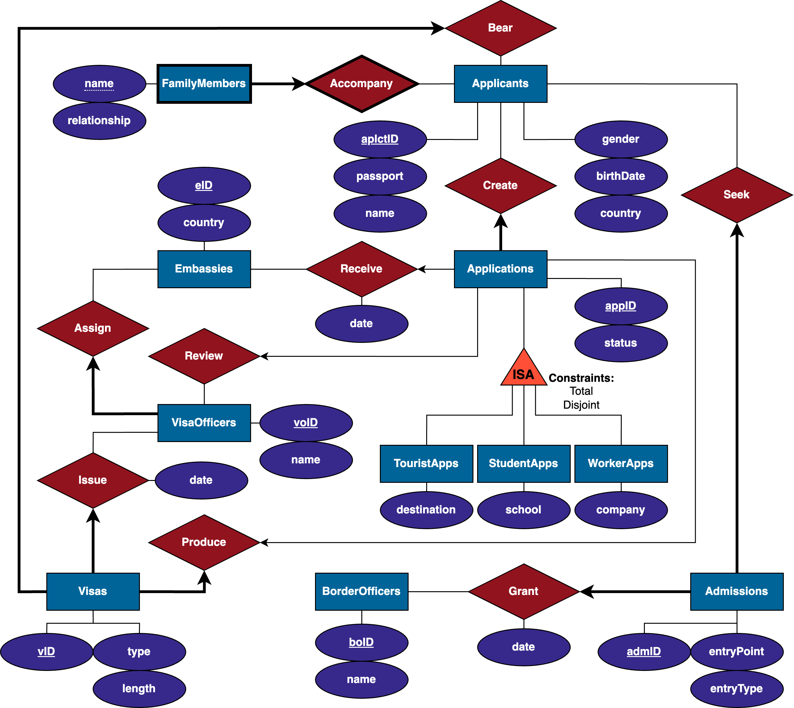

# Visa Info Management System

[Project Demo](https://www.students.cs.ubc.ca/~ykzhao/project_d3h5t_d7y9d_l4q3n)

[Milestone 4 - Project Implementation](/Milestone4.pdf)

## Project Description:
The final project is a combination of visa application, processing and info management system based on a relational database and a web GUI. It modeled the processes of visa application, approval and usage, involving data exchange of entities like applicants, applications, family members, embassies, visas, visa officers, border officers, etc.

## Database specifications / functionalities:
this application succeeded in…

- Providing a web-based user-friendly graphical interface
- Presenting appropriate data to proper users in such a way that they chose
- Allowing applicants to create, submit and track visa applications, which a visa officer, assigned by an embassy, will then review and approve
- Allowing a border officer to record the admission of an applicant
- Allowing an administrator to reset the database and run various meaningful queries about the data
- Streamlining the whole process, enforce necessary constraints and maintain data integrity

## Tech Stack:
This application used PHP/Oracle for back-end, and HTML, CSS, and JavaScript for front-end programming.

## ER-Diagram

## Notes:
All Commits made by "UBC Student" are actually made by Yingkai Zhao.
